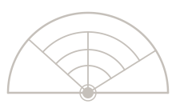

<p align="center">
  
</p>

<h1 align="center">tutti</h1>

Developer workflow orchestration CLI. Syncs data from Jira and GitHub into a ticket-centric folder structure and provides an AI orchestrator (Claude Code session) that reviews state and produces artifacts.

## Quick Start

```bash
cd tutti-cli
python3 -m venv .venv
source .venv/bin/activate
pip install -e ".[dev]"

tutti init --workspace-root ~/workspace/tutti
```

## Configuration

Set environment variables for external service auth:

```bash
export JIRA_EMAIL="you@company.com"
export JIRA_TOKEN="your-jira-api-token"
export GH_TOKEN="your-github-pat"
```

Edit `config.yaml` in your workspace root to configure the Jira domain, JQL query, repo paths, trust tiers, and sync intervals.

## Commands

```
tutti init                          Create workspace skeleton
tutti config                        View configuration
tutti sync                          Run all sync sources
tutti sync jira                     Sync Jira tickets
tutti sync github                   Sync GitHub pull requests
tutti sync ci                       Sync CI status
tutti sync sessions                 Sync Claude Code session data
tutti sync workspace                Sync local git workspace state
tutti ticket list                   List tracked tickets
tutti ticket show <KEY>             Show ticket details and artifacts
tutti workspace create <KEY>        Create workspace for a ticket
tutti workspace add-repo <KEY> <R>  Add a repo worktree
tutti workspace status              Show workspace health
tutti archive list                  List archived tickets
tutti archive restore <KEY>         Restore an archived ticket
tutti priority                      Show priority list
tutti priority set <KEY> [KEY...]   Set priority order
tutti orchestrate                   Launch orchestrator session
tutti orchestrate --ticket <KEY>    Focus on a specific ticket
```

All commands support `--json` for structured output and `--workspace-root` to override the workspace location.

## Workspace Structure

```
{workspace_root}/
    config.yaml
    PRIORITY.md
    WORKFLOW.md
    .claude/CLAUDE.md
    {EPIC_KEY}-{slug}/
        {TICKET_KEY}-{slug}/
            orchestrator/
                TICKET.md              # sync: Jira data
                PULL_REQUESTS.md       # sync: GitHub PRs
                CI.md                  # sync: build status
                CLAUDE_SESSIONS.md     # sync: active sessions
                WORKSPACE.md           # sync: git state
                BACKGROUND.md          # authored: context
                AC.md                  # authored: acceptance criteria
                SPEC.md                # authored: technical spec
                ORCHESTRATOR.md        # authored: working notes
            repo-worktree/
    .archive/
```

Files with `source: sync` frontmatter are overwritten each sync cycle. Authored files are created by the developer or orchestrator and persist.

## Development

```bash
source .venv/bin/activate
pytest                  # run tests
ruff check src/ tests/  # lint
```

## Architecture

tutti is a Python package with a library-first design. The CLI (`tutti.cli`) is a thin wrapper around the library. A Python TUI can import the library directly; a Rust TUI can use subprocess + `--json` output.

See [SPEC.md](SPEC.md) for the full specification.
